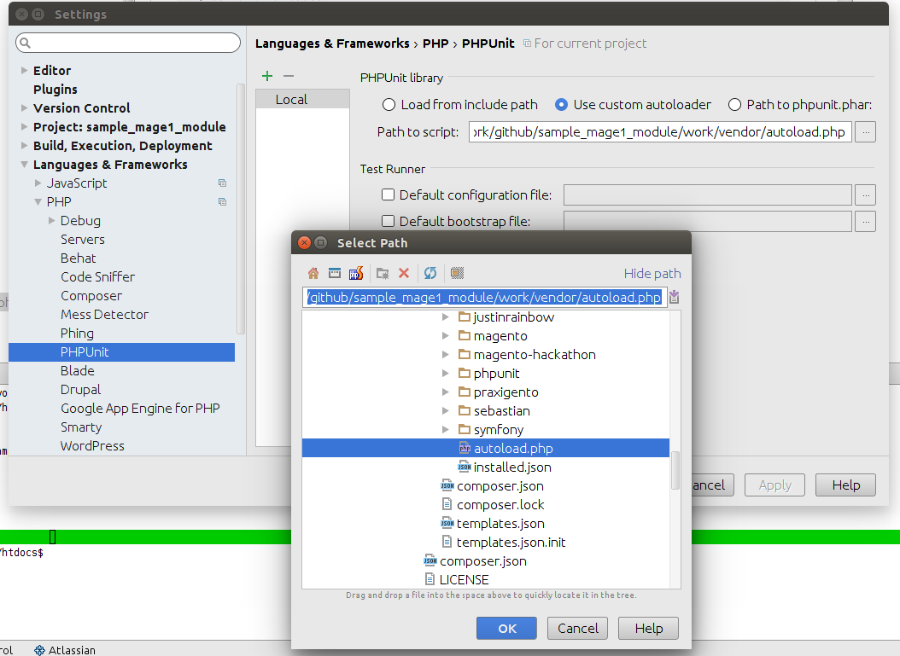
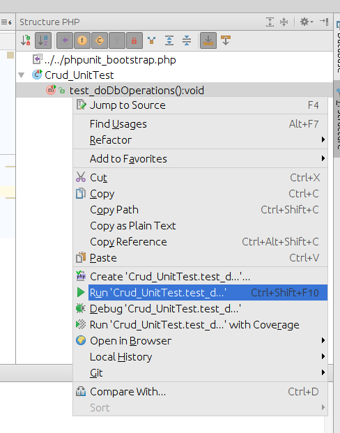

# Tests running in Magento v1 module

## Test modes

There are 2 test modes used in this sample module:
* Unit tests: lightweight tests w/o establishing DB connection;
* Dvlp tests: these are not pure tests, these scripts should be launched from IDE to learn Magento aspects.

## Launch unit tests

    $ cd ./work/htdocs 
    $ phpunit -c ./app/code/community/Flancer32/Sample/Test/phpunit.dist.xml 

## Launch dvlp tests

I use PhpStorm. Setup Composer autoload function for PHPUnit in PhpStorm:

Go to `./work/htdocs/app/code/community/Flancer32/Sample/Test/Dvlp/...` 
and start test class or method in 'run' or 'debug' mode 
(mouse right click then select action):

